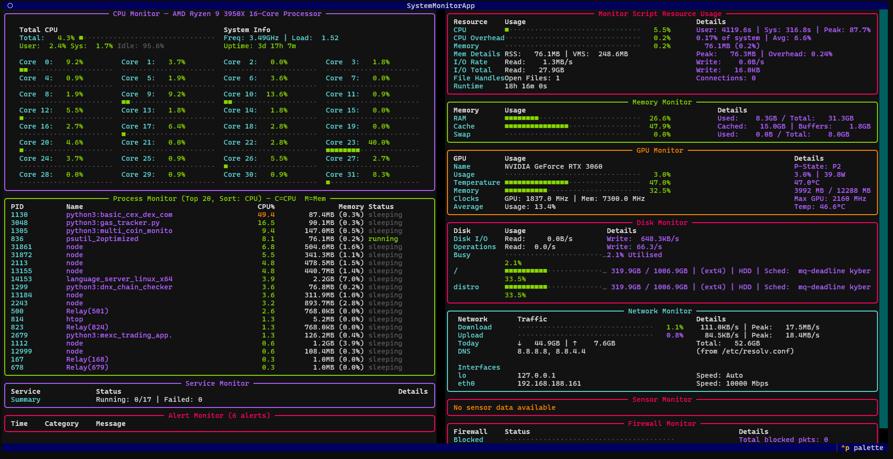

# System Monitor App



All-in-one system resource monitor TUI for developers. Track CPU, memory, disk I/O, network, GPU, sensors, temperatures and processes in a single terminal window instead of managing multiple htop/top/dstat instances.

## Overview

A terminal-based system monitoring dashboard that consolidates hardware metrics, process information, and resource usage into one clean interface. Built for developers who need quick visibility into system state without switching between multiple monitoring tools.

## Key Features

- **CPU Monitoring** — Real-time usage with per-core breakdown and history graphs
- **Memory Tracking** — RAM usage, swap status, and process-level consumption  
- **Disk I/O** — Read/write throughput with per-device statistics
- **Network Stats** — RX/TX bandwidth, connection tracking, interface details
- **GPU Monitoring** — GPU usage, memory, temperature (NVIDIA tested, AMD maybe)
- **Sensors & Temperatures** — CPU thermal zones, fan speeds, voltages
- **Process Table** — Sortable process list with resource consumption
- **TUI Interface** — Keyboard-driven interface

## Why This Exists

Instead of running 7 different terminals with htop, iostat, dstat, netstat, nvidia-smi, sensors, etc., this provides a unified view in a single terminal window. Optimized for developer workflow during debugging, profiling, or general system health checks.

## Quick Start

```bash
# Download the Linux x64 binary and run
./system_monitor_app
```

## Typical Workflow

1. Launch during development or debugging sessions
2. Monitor resource impact of running applications
3. Check GPU temps during ML training or mining
4. Watch CPU thermals under load
5. Identify resource-heavy processes quickly
6. Check network I/O during API/chain monitoring
7. Track disk usage during data processing

## Dev Notes

- **Static binary for Linux x64** — no dependencies required
- Cross-platform terminal support
- Minimal resource footprint
- Configurable refresh intervals
- Suitable for remote SSH sessions
- GPU monitoring via NVML (NVIDIA tested) or sysfs (AMD maybe)
- Sensors via lm-sensors interface

## Contact

Questions or feedback? [Get in touch](https://logicencoder.com/contact/)

---

*Terminal monitoring without the terminal clutter.*
